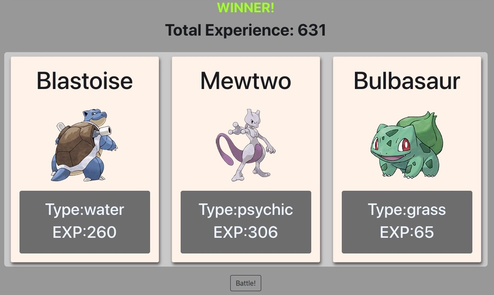

## Mini Pokemon Card Game!

    

    
## table of contents 

* [description](#Description)
* [contribution](#Contribution)  
* [insitillation](#Instillation)
* [usage](#Usage)
* [testing](#Testing)
  

## Description: 

This is a fairly simple Pokemon card mini game built in React that has some fun parts to it. I have used CSS Animate and CSS hover for some fun animation tricks and have borrowed the pictures from the pokemon API. There is some logic created for the game component and different use of components and props to get the desired effects. The game is very simple, just click the "Battle!" button and the two hands are randomly assigned some pokemon. The two hands total EXP is calculated and the winner is shown on the screen. The app is mobile responsive as well.  
    
    
## Contribution:

Anyone can feel free to contribute or take the code and build on it themselves! 
    
## Questions?

* **Please check out:** Feel free to contact me at the below correspondents
* **Or you can reach to me on Github here:** [Github](https://github.com/zackdeacon)
* **Im also available via email here:** [Email me!](zackdeacon347@gmail.com) 
    
    
## Installation 

    
  No instillation required, just click "Battle!" 
    
## Usage 

    
  The game is very simple, just click the "Battle!" button and the two hands are randomly assigned some pokemon. The two hands total EXP is calculated and the winner is shown on the screen.
    
## Testing 

    
  No Tests
  
## Deployed Link 

 https://pkmn-mini-game.herokuapp.com/
 
## Screen Shot of Deployed Application 
 
    
